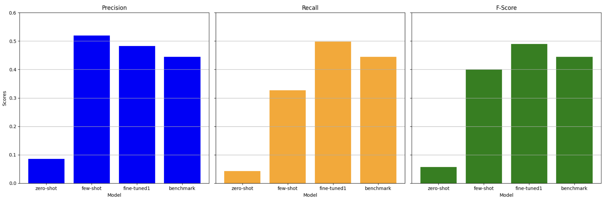

# biographical-parser

## Description

In this project, I used GPT-3.5-turbo to transform unstructured data in the form of a biography to structured data in the form of attribute-value pairs. To accomplish this task, I used zero shot learning, few shot learning and finely-tuned models. 

The test and train datasets were obtained through a homework assignment. In the original assignment, we created a parser using a finely-tuned model; I took this assignment further, expermenting with other techniques such as zero shot and few shot learning. In the assignment, performance metrics above 0.4 were considered a success. The head TA built a model that obtained scores of ~0.44 on all 3 metrics.

## Results

## Discussion

Though the zero shot model yielded relevant and coherent responses on individual test cases, it performed quite poorly on all 3 metrics failing to identify most attribute-value pairs. Few shot prompting yielded significant improvements across all metrics when compared to zero shot. Few shot even outperformed each of the fine-tuned models on precision but achieved lower recall and f-scores. Ultimately model 'fine-tuned-1' yielded the best overall performance. **Model fine-tuned-1 outperformed the benchmark on all 3 metrics by an average of 10.5%.**

A significant takeaway for me was that increasing the number of training samples did not necessarily improve performance. The models performed similarly when using 3 training examples (few shot) as with 50-100 training examples (fine-tuned). If I were to redo this project, I would focus on data quality. I would analyze the attributes most common amongst datasets and build a trainig dataset that is smaller but encapsulates all important attributes. This [talk](https://www.youtube.com/watch?v=ahnGLM-RC1Y) on maximizing LLM performance from OpenAI's developer conference supports my assertion that data quality is more important than data quantity.

It is also worth noting that this is a very challening problem - the model needs to parse a biography and obtain an unknown number of attributes and unknown attribute types. This combined with the strict evaluation method makes this a difficult problem. When designing a parser for a particular application, it is important to focus on the desired output and reduce the complexity of the problem through simplifications. For example we could reduce the complexity of the probem and obtain better results by defining a set of attribute types that the model should capture.

In addition to these considerations, it would also be interesting to compare the performance of different LLM models at performing this task (gpt-4, gpt-4o, Llama 3.1, etc.).

Please go through the notebook 'biographical_parser_gpt.ipynb' for additional details.
